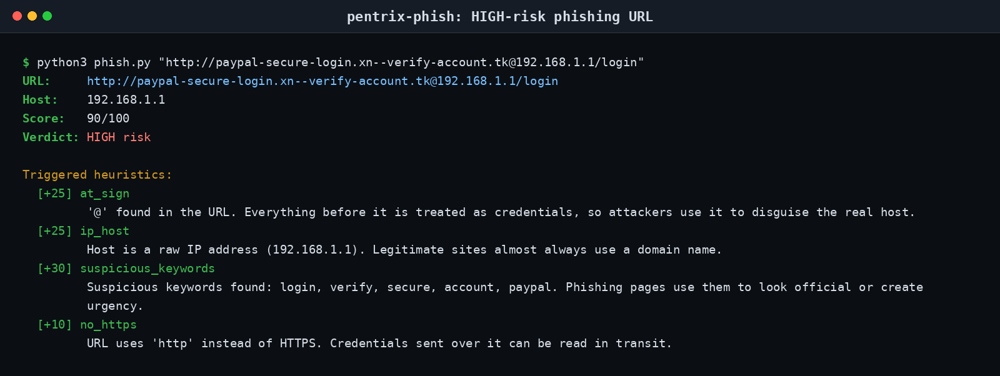
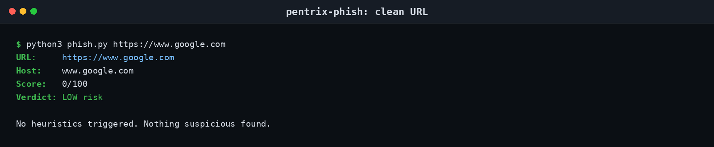
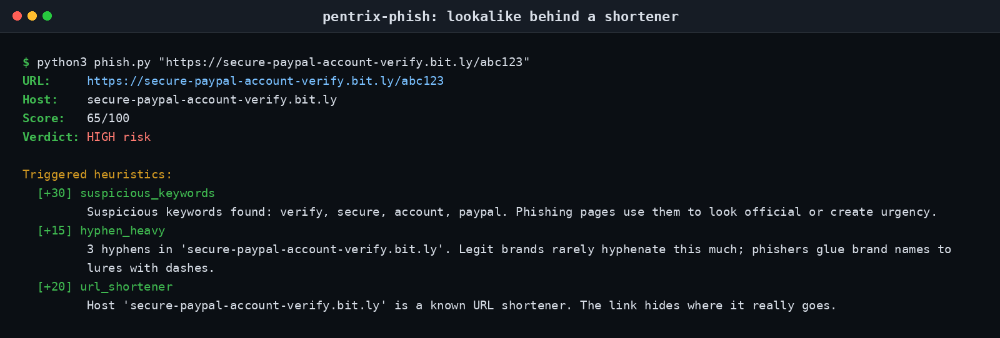

# pentrix-phish


A tiny command-line tool that scores URLs for **phishing red flags**. It runs 10 heuristics against a URL (punycode tricks, `@` credential confusion, IP hosts, URL shorteners, and more), adds up the points, and prints a risk verdict. Standard library only, no pip install needed, fully offline.

## Contents

- [Screenshots](#screenshots)
- [Features](#features)
- [Heuristics](#heuristics)
- [Install](#install)
- [Usage](#usage)
- [Exit codes](#exit-codes)
- [Disclaimer](#disclaimer)
- [License](#license)

## Screenshots

A crafted phishing-style URL lighting up four heuristics at once:



A clean URL scores zero and stays quiet:



A lookalike domain hiding behind a URL shortener:



## Features

- **10 phishing heuristics**, each with a fixed weight and a plain-English explanation printed when it fires
- **Score 0-100** with verdict bands: `LOW` (0-29), `MEDIUM` (30-59), `HIGH` (60+)
- **Batch mode**: analyze one URL, a positional URL plus a file, or a whole list via `-f urls.txt`
- **JSON output** with `--json` for scripting and pipelines
- **Graceful on garbage**: malformed URLs are skipped with a clear error, never a traceback
- **Zero dependencies**: only `urllib.parse`, `argparse`, `re`, `json`, `sys`
- Sensible exit codes: `0` ok, `1` usage error, `2` malformed URL

## Heuristics

| Heuristic | Weight | What it catches |
|---|---|---|
| `punycode` | 20 | `xn--` in the host: IDN homograph lookalikes (payp`a`l with a Cyrillic a) |
| `at_sign` | 25 | `@` in the URL: everything before it is treated as credentials, so `bank.com@evil.com` really goes to `evil.com` |
| `ip_host` | 25 | Host is a raw IP literal (`http://192.168.1.1/login`): legit sites use domain names |
| `nonstandard_port` | 10 | Port other than 80/443, e.g. `example.com:8443` |
| `many_subdomains` | 10 | More than 3 subdomains: attackers pad `secure.login.verify.example.evil.com` |
| `suspicious_keywords` | 10 each, capped at 30 | Lure words in host/path: `login, verify, secure, account, update, paypal, bank, signin, confirm, free, bonus` |
| `long_url` | 10 | URL longer than 100 chars: padding hides the real host from a quick glance |
| `hyphen_heavy` | 15 | 3+ hyphens in the host (`secure-paypal-account-verify...`): brands rarely hyphenate, phishers do |
| `no_https` | 10 | Scheme is not HTTPS: credentials can be read in transit |
| `url_shortener` | 20 | Known shortener host (`bit.ly`, `tinyurl.com`, `t.co`, ...): hides the real destination |

Score is capped at 100. Bands: **LOW** 0-29, **MEDIUM** 30-59, **HIGH** 60+.

## Install

```bash
git clone https://github.com/mizazhaider-ceh/pentrix-phish.git
cd pentrix-phish
# nothing to install: Python 3 only, standard library
python3 phish.py --help
```

Requires Python 3.8+.

## Usage

Analyze a single URL:

```bash
python3 phish.py https://www.google.com
```

```
URL:     https://www.google.com
Host:    www.google.com
Score:   0/100
Verdict: LOW risk

No heuristics triggered. Nothing suspicious found.
```

A legit login page still flags the `login` keyword, but the score stays LOW, which is the point of scoring instead of blocking:

```bash
python3 phish.py https://github.com/login
```

```
URL:     https://github.com/login
Host:    github.com
Score:   10/100
Verdict: LOW risk

Triggered heuristics:
  [+10] suspicious_keywords
         Suspicious keywords found: login. Phishing pages use them to look official or create urgency.
```

A synthetic phishing URL (do not visit crafted lookalikes in real life):

```bash
python3 phish.py 'http://paypal-secure-login.xn--verify-account.tk@192.168.1.1/login'
```

```
URL:     http://paypal-secure-login.xn--verify-account.tk@192.168.1.1/login
Host:    192.168.1.1
Score:   90/100
Verdict: HIGH risk

Triggered heuristics:
  [+25] at_sign
         '@' found in the URL. Everything before it is treated as credentials, so attackers use it to disguise the real host.
  [+25] ip_host
         Host is a raw IP address (192.168.1.1). Legitimate sites almost always use a domain name.
  [+30] suspicious_keywords
         Suspicious keywords found: login, verify, secure, account, paypal. Phishing pages use them to look official or create urgency.
  [+10] no_https
         URL uses 'http' instead of HTTPS. Credentials sent over it can be read in transit.
```

Another one, a lookalike behind a shortener:

```bash
python3 phish.py 'https://secure-paypal-account-verify.bit.ly/abc123'
```

```
URL:     https://secure-paypal-account-verify.bit.ly/abc123
Host:    secure-paypal-account-verify.bit.ly
Score:   65/100
Verdict: HIGH risk

Triggered heuristics:
  [+30] suspicious_keywords
         Suspicious keywords found: verify, secure, account, paypal. Phishing pages use them to look official or create urgency.
  [+15] hyphen_heavy
         3 hyphens in 'secure-paypal-account-verify.bit.ly'. Legit brands rarely hyphenate this much; phishers glue brand names to lures with dashes.
  [+20] url_shortener
         Host 'secure-paypal-account-verify.bit.ly' is a known URL shortener. The link hides where it really goes.
```

Batch mode (one URL per line, `#` comments and blank lines ignored):

```bash
printf 'https://www.google.com\nhttps://github.com/login\n' > urls.txt
python3 phish.py -f urls.txt
```

Machine-readable output:

```bash
python3 phish.py --json 'https://secure-paypal-account-verify.bit.ly/abc123'
```

```json
{
  "url": "https://secure-paypal-account-verify.bit.ly/abc123",
  "host": "secure-paypal-account-verify.bit.ly",
  "score": 65,
  "verdict": "HIGH",
  "findings": [
    {
      "name": "suspicious_keywords",
      "points": 30,
      "detail": "Suspicious keywords found: verify, secure, account, paypal. Phishing pages use them to look official or create urgency."
    },
    {
      "name": "hyphen_heavy",
      "points": 15,
      "detail": "3 hyphens in 'secure-paypal-account-verify.bit.ly'. Legit brands rarely hyphenate this much; phishers glue brand names to lures with dashes."
    },
    {
      "name": "url_shortener",
      "points": 20,
      "detail": "Host 'secure-paypal-account-verify.bit.ly' is a known URL shortener. The link hides where it really goes."
    }
  ]
}
```

## Exit codes

| Code | Meaning |
|---|---|
| `0` | Analysis completed (any verdict, including HIGH) |
| `1` | Usage error (bad arguments, unreadable input file) |
| `2` | At least one URL was malformed and could not be parsed |

## Disclaimer

Heuristics are hints, **not proof**. A LOW score does not mean a URL is safe (a fresh phishing domain can look clean), and a HIGH score does not mean it is malicious (legit marketing links use shorteners and long URLs). False positives and false negatives are both possible. Always verify before clicking, logging in, or entering payment details: check the real domain in your browser's address bar, and when in doubt, navigate to the site yourself instead of following the link.

## License

MIT. See [LICENSE](LICENSE).
